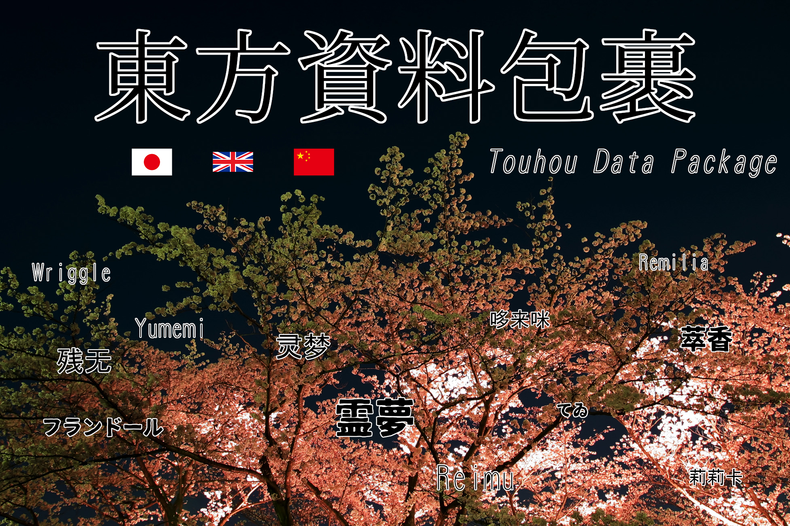

# Touhou Data Package


**English：README-en.pdf**

**日本語：README-ja.pdf**

**中文：README-zh.pdf**

## Overview
Touhou Data Package is a data package that allows you to obtain information about Touhou Project characters.

It covers characters from the latest works (Fossilized Wonders), PC-98, and Books.

The following information about each character, such as Reimu, can be easily obtained from the source code.

- Name
- Full name
- A unique number and string set for each character
   - Can be used in PlayerPrefs and branching in switch statements.

Names and full names are also translated into the following languages.

- Japanese
   - Readings and readings of the full name can also be obtained.
- English
- Chinese

## Installation
Import the `TouhouDataPackage.unitypackage`.

## Requirements
Unity 2020.2 or later

This package uses switch expressions, so a Unity version that supports C# 8.0 or later is required.

## Reference
This package exists entirely in the `TouhouData` namespace.

Therefore, when using this package, add the following using directive.

```cs
using TouhouData;
```

### Character
This is a character class from the Touhou Project.

Basically it only contains static variables and constants, but the class itself is not static so it can be inherited.

**Static Properties**

| Name | Explanation |
| --- | --- |
| [`(Any Character)`](#any-character) | Character information from the Touhou Project (read-only). <br>It can be referenced in a manner similar to an Enum, such as `Character.Reimu`. <br>For information about characters that can be referenced, see the notes below. |

**Properties**

| Name | Explanation |
| --- | --- |
| [`Name`](#name) | The name of the Touhou character (read-only). Does not include family name etc. <br>The returned string will change depending on the language set with ChangeLanguage. |
| [`FullName`](#fullname) | The full name of the Touhou character (read-only). <br>The returned string will change depending on the language set with ChangeLanguage. |
| [`Locales.(Any Locale).Name`](#localesany-localename) | The name of the Touhou character (read only). Does not include surname etc. |
| [`Locales.(Any Locale).FullName`](#localesany-localefullname) | The full name of the Touhou character (read only). |
| [`Locales.Ja.NameKana`](#localesjanamekana) | The Touhou character's name in hiragana (read-only). Does not include family name etc. <br>This variable exists only in Locales.Ja. |
| [`Locales.Ja.FullNameKana`](#localesjafullnamekana) | The full name of the Touhou character in hiragana. This variable exists only in Locales.Ja. |
| [`String`](#string) | A unique string value assigned to each Touhou character (read-only). |
| [`ID`](#id) | A unique int value assigned to each Touhou character (read-only). |

**Static Methods**

| Name | Explanation |
| --- | --- |
| [`ChangeLanguage`](#changelanguage) | Set the language for Name and FullName. |
| [`Get`](#get) | This function returns a specific Character. Int and string values ​​can be specified as arguments. |

**Methods**

| Name | Explanation |
| --- | --- |
| [`ToString`](#tostring) | Returns a `String`. |

**Constants**

| Name | Explanation |
| --- | --- |
| [`length`](#length) | The number of characters included in this package (160). |
| [`Strings.(Any Character)`](#stringsany-character) | A String of any Touhou character. |
| [`IDs.(Any Character)`](#idsany-character) | A ID of any Touhou character. |

**Classes**

| Name | Explanation |
| --- | --- |
| [`Strings`](#strings) | This is a class that has a String of any Touhou character as a member. |
| [`IDs`](#ids) | This is a class that has a ID of any Touhou character as a member. |
| [`Locale`](#locale) | A class that has `Name` and `FullName` members. |
| [`LocaleJa`](#localeja) | A class that inherits from `Locale` and has additional `NameKana` and `FullNameKana` members. |
| [`CharacterLocales`](#characterlocales) | A class with members `Ja` for `LocaleJa`, `En` and `Zh` for `Locale`. |

#### (Any Character)
Information about Touhou Project characters (read-only).

This is a static, readonly variable that can be referenced in a manner similar to an Enum, such as Character.Reimu.

Please see the notes below for information about the characters that can be referenced.

```cs
Character character1 = Character.Reimu;
Character character2 = Character.Marisa;
```

#### SelectedLanguage
The SystemLanguage for Name and FullName (read-only).

It can have one of three values:

- SystemLanguage.Japanese
- SystemLanguage.English
- SystemLanguage.Chinese

#### Name
The name of the Touhou character (read-only). Does not include family name etc.

The returned string will change depending on the language set with ChangeLanguage.

```cs
Character character = Character.Reimu;
Character.ChangeLanguage ("ja");
Debug.Log (character.Name); // 霊夢
Character.ChangeLanguage ("en");
Debug.Log (character.Name); // Reimu
Character.ChangeLanguage ("zh");
Debug.Log (character.Name); // 灵梦
```

#### FullName
The full name of the Touhou character (read-only).

The returned string will change depending on the language set with ChangeLanguage.

```cs
Character character = Character.Reisen;
Character.ChangeLanguage (SystemLanguage.Japanese);
Debug.Log (character.FullName); // 鈴仙・優曇華院・イナバ
Character.ChangeLanguage (SystemLanguage.English);
Debug.Log (character.FullName); // Reisen Udongein Inaba
Character.ChangeLanguage (SystemLanguage.Chinese);
Debug.Log (character.FullName); // 铃仙·优昙华院·因幡
```

#### Locales
The translated information is contained in this variable.

The correspondence between languages ​​and locales is as follows:

- Locales.Ja: Japanese
- Locales.En: English
- Locales.Zh: Chinese

##### Locales.(Any Locale).Name
The name of the Touhou character (read only). Does not include surname etc.

```cs
Character character = Character.Remilia;
Debug.Log (character.Locales.Ja.Name); // レミリア
Debug.Log (character.Locales.En.Name); // Remilia
Debug.Log (character.Locales.Zh.Name); // 蕾米莉亚
```

##### Locales.(Any Locale).FullName
The full name of the Touhou character (read only).

```cs
Character character = Character.Marisa;
Debug.Log (character.Locales.Ja.FullName); // 霧雨 魔理沙
Debug.Log (character.Locales.En.FullName); // Marisa Kirisame
Debug.Log (character.Locales.Zh.FullName); // 雾雨 魔理沙
```

##### Locales.Ja.NameKana
The Touhou character's name in hiragana (read-only). Does not include family name etc. This variable exists only in Locales.Ja.

```cs
Debug.Log (Character.Sakuya.Locales.Ja.NameKana); // さくや
Debug.Log (Character.Nitori.Locales.Ja.NameKana); // にとり
Debug.Log (Character.Alice.Locales.Ja.NameKana); // ありす
```

##### Locales.Ja.FullNameKana
The full name of the Touhou character in hiragana. This variable exists only in Locales.Ja.

```cs
Debug.Log (Character.Komachi.Locales.Ja.FullNameKana); // おのづか こまち
Debug.Log (Character.Tewi.Locales.Ja.FullNameKana); // いなば てゐ
Debug.Log (Character.Eiki.Locales.Ja.FullNameKana); // しき えいき・やまざなどぅ
```

#### String
A unique string value assigned to each Touhou character (read-only).

This value is exactly the same as the static variable name of the Touhou character.

Also, `ToString` returns this value.

This value will not change in future version updates.

Therefore, you can safely use this value as a PlayerPrefs key.

```cs
Debug.Log (Character.Reisen.String); // Reisen
Debug.Log (Character.ReisenSecond.String); // ReisenSecond
PlayerPrefs.SetString(Character.Reisen.String + "_Nickname", "Udonge");
PlayerPrefs.SetInt(Character.ReisenSecond.String + "_Power", 20);
```

#### ID
A unique int value assigned to Touhou characters (read-only).

This value is the same as the index when `String` is sorted in English dictionary order.

This value will change in future updates.

Therefore, it is not recommended to use it as a PlayerPrefs key.

```cs
Debug.Log (Character.Akyuu.ID); // 0
Debug.Log (Character.Alice.ID); // 1
Debug.Log (Character.Zanmu.ID); // 165
```

#### ChangeLanguage
Sets the language for Name and FullName.

SystemLanguage and string can be passed as arguments.

String is case-insensitive.

If a language argument not supported by this package is passed, English will be used.

Run this function in the first script run by your game, or in a script that sets the language.

If you do not run this function, the language will be set automatically based on `Application.systemLanguage`.

**Argument values ​​and configuration language**

- Argument: Setting language
- SystemLanguage.Japanese: Japanese
- SystemLanguage.English: English
- SystemLanguage.Chinese, SystemLanguage.ChineseSimplified, SystemLanguage.ChineseTraditional: Chinese
- "ja": Japanese
- "en": English
- "zh": Chinese
- Other: English

```cs
Character.ChangeLanguage (SystemLanguage.Japanese); // Japanese
Character.ChangeLanguage ("en"); // English
Character.ChangeLanguage ("Zh"); // Chinese
Character.ChangeLanguage ("aaaaa"); // English
```

#### Get
This function returns a specific Character. The argument can be an int or string value.

If an int value is specified, the character whose `ID` matches the int value will be returned.

If a string value is specified, the character whose string value matches the `String` will be returned.

In either case, if the corresponding Character does not exist, null will be returned.

```cs
Character character1 = Character.Get (0);
Character character2 = Character.Get ("Reimu");
Character character3 = Character.Get (-999);
Character character4 = Character.Get ("aaaaaaaaaaaaaaaa");

if (character1 != null)
{
    Debug.Log (character1.FullName); // Hieda no Akyuu
}
Debug.Log (character2?.FullName); // Reimu Hakurei
Debug.Log (character3?.FullName); // null
Debug.Log (character4); // null
```

#### ToString
Returns a `String`.

```cs
Debug.Log (Character.Reisen.ToString ()); // Reisen
Debug.Log (Character.ReisenSecond.ToString ()); // ReisenSecond
PlayerPrefs.SetString(Character.Reisen.ToString () + "_Nickname", "Udonge");
PlayerPrefs.SetInt(Character.ReisenSecond.ToString () + "_Power", 20);
```

#### length
The number of characters included in this package (160).

This is useful when you want to get a random character or when running a for loop.

```cs
Character randomCharacter = Character.Get (Random.Range (0, Character.length)); // Random character

for (int i = 0; i < Character.length; i++)
{
   Character character = Character.Get (i);
   if (character != null)
   {
      Debug.Log (character.String); // Akyuu, Alice, Ariya, ... , Yuuma, Yuyuko, Zanmu
   }
}
```

#### Strings.(Any Character)
A String of any Touhou character (constant).

Since it's a constant, it can be used in a switch statement or as a PlayerPrefs key.

```cs
Character character = Character.Get (Random.Range (0, Character.length));

switch (character.String)
{
case Character.Strings.Ekisya:
case Character.Strings.Genjii:
case Character.Strings.Rinnosuke:
   Debug.Log (character.FullName + " is a man.");
   break;
case Character.Strings.Singyoku:
   Debug.Log (character.FullName + " can be male or female.");
   break;
default:
   Debug.Log (character.FullName + " is a woman.");
   break;
}
```

#### IDs.(Any Character)
The ID of any Touhou character (constant).

Since it's a constant, it can be used in a switch statement.

```cs
Character character = Character.Get (Random.Range (0, Character.length));

switch (character.ID)
{
case Character.IDs.Ekisya:
case Character.IDs.Genjii:
case Character.IDs.Rinnosuke:
   Debug.Log (character.FullName + " is a man.");
   break;
case Character.IDs.Singyoku:
   Debug.Log (character.FullName + " can be male or female.");
   break;
default:
   Debug.Log (character.FullName + " is a woman.");
   break;
}
```

#### Strings
This class has the String value of any Touhou character as a member.

All members are constants, but since it is not a static class, it can be inherited.

#### IDs
This class has the ID value of any Touhou character as a member.

All members are constants, but since it is not a static class, it can be inherited.

#### Locale
A class that has `Name` and `FullName` members.

#### LocaleJa
A class that inherits from `Locale` and has additional `NameKana` and `FullNameKana` members.

#### CharacterLocales
A class with members `Ja` for `LocaleJa`, `En` and `Zh` for `Locale`.

Using this class in (Any Character).Locales.

## Samples
The Samples directory contains examples of how to use this package, as well as templates that are useful when using it.

- `TouhouDataPackageSample.unity` ： This is a sample of an encyclopedia of Touhou characters created using Character.
   - `Scripts/TouhouDataPackageSample.cs` ： This is the script used in this scene. It uses all the functions of the Character class.
- `TouhouDataPackageExtendedSample.unity` ： This is a sample that extends Character to create an encyclopedia of Touhou characters.
   - `Scripts/TouhouDataPackageExtendedSample.cs` ： This is the script used in this scene. It uses a class that inherits all the functions of the Character class.
- `TouhouDataPackageTemplate.txt` ： Templates for switch statements for all characters are written here.

If you prepare an image with the same name as Character.String (e.g. Reimu.png) in the Assets/Resources/Pictures/Character directory, the character image will be displayed in the sample scene.

## Note
### Characters included in the package
Below are the English names of the characters supported by this package. (If the static variable name differs from the English name, it is listed in parentheses.)

- Akyuu
- Alice
- Ariya
- Aunn
- Aya
- Benben
- Biten
- Byakuren
- Chen
- Chimata
- Chimi
- Chiyari
- Chiyuri
- Cirno
- Clownpiece
- Daiyousei
- Doremy
- Eika
- Eiki
- Eirin
- Ekisya
- Elis
- Ellen
- Elly
- Enoko
- Eternitylarva
- Flandre
- Futo
- Gengetu
- Genjii
- Hatate
- Hecatia
- Hina
- Hisami
- Ichirin
- Iku
- Junko
- Jyoon
- Kagerou
- Kaguya
- Kana
- Kanako
- Kasen
- Keiki
- Keine
- Kikuri
- Kisume
- Koakuma
- Kogasa
- Koishi
- Kokoro
- Komachi
- Konngara
- Kosuzu
- Kotohime
- Kurumi
- Kutaka
- Kyouko
- Letty
- Lilywhite
- Luize
- Lunarchild
- Lunasa
- Lyrica
- Mai
- Mamizou
- Maribel
- Marisa
- Mayumi
- Medicine
- Megumu
- Meira
- Meirin
- Merlin
- Mike
- Miko
- Mima
- Minamitsu
- Minoriko
- Misumaru
- Miyoi
- Mizuchi
- Mokou
- Momizi
- Momoyo
- Mugetu
- Mystia
- Nareko
- Narumi
- Nazrin
- Nemuno
- Nina
- Nitori
- Nue
- Okina
- Orange
- Parsee
- Patchouli
- Raiko
- Ran
- Reimu
- Reisen
- ReisenSecond(Reisen)
- Remilia
- Renko
- Rika
- Rikako
- Rin
- Ringo
- Rinnosuke
- Rumia
- Ruukoto
- Sagume
- Saki
- Sakuya
- Sanae
- Sannyo
- Sara
- Sariel
- Satono
- Satori
- Seiga
- Seija
- Seiran
- Sekibanki
- Shinki
- Shinmyoumaru
- Shion
- Shizuha
- Singyoku
- Starsapphire
- Suika
- Sumireko
- Sunnymilk
- Suwako
- Syou
- Takane
- Teireida(Mai)
- Tenshi
- Tewi
- Tojiko
- Tokiko
- Toyohime
- Tsukasa
- Ubame
- Urumi
- Utsuho
- Wakasagihime
- Wriggle
- Yachie
- Yamame
- Yatsuhashi
- Yorihime
- Yoshika
- Youmu
- Yuiman
- Yukari
- Yuki
- Yumeko
- Yumemi
- Yuugenmagan
- Yuugi
- Yuuka
- Yuuma
- Yuyuko
- Zanmu

Characters that do not exist above will not be included in the package.

Characters that meet the following criteria have been specifically excluded from this package.

- Characters only in the setting
   - Satsukirin, Iwakasa, Myouren, etc.
- Characters that are too minor
   - Manzairaku, Hofgoblin, etc.
   - Ruukoto, Tokiko, Ekisya are included in the package
- Secondary creation characters
   - Ha Seoi, Sasha Sashiromiya, etc.
- Non-living things
   - Mimichan, Rocks on the way to Stage 1 of Subterranean Animism, etc.
- Non-Touhou characters
   - Characters from Seihou Project, Portrait of Exotic Girls, etc.

If you want to use a character not included in this package, please refer to `Samples/Scripts/TouhouDataPackageExtendedSample.cs` and create a class that extends the `TouhouData.Character` class.

Considering the addition of future characters, it is not recommended to modify the `TouhouData.Character` class itself.

### About the name
#### Handling fairy names
Fairy names often consist of two words, such as Starsapphire.

In this case, both words are treated as the first name, and there is no surname.

Also, in the case of English names, there is no space between the two words, and the second word is not capitalized.

#### About the character's English name
The spelling in the original work takes priority.

For example, Hong Meirin's English name, `Meirin`, is generally written as `Meiling` in pinyin, but this package uses the `Meirin` used in the original work.

The Japanese character "ji" is written as `ji` and `zi`, and the character "shi" is written as `si` and `shi`, so there is a mixture of Hepburn spellings, but the spelling in the original work takes priority and this mixture is allowed.

As an exception, characters who meet the following conditions will use the notation found on the Touhou Wiki.

- The original text is clearly a typo
   - Starsapphire
- The original spelling makes it difficult to pronounce correctly.
   - Yuuka
   - Yuugi
   - Yachie
   - Mayumi
   - Chimata
   - Yuuma

#### About the Chinese names of characters
All follow the [THBWiki](https://thwiki.cc/%E9%A6%96%E9%A1%B5) notation.

### About String
Basically the same as `Locales.En.Name`, but if there are characters with duplicate `Locales.En.Name`, it will be a different value.

### About summaries
In order to make summaries easier to read, we have implemented summaries in Japanese and English only.

## Bibliography
- [東方元ネタwiki 2nd](https://seesaawiki.jp/toho-motoneta_2nd/d/%a5%c8%a5%c3%a5%d7%a5%da%a1%bc%a5%b8)
- [Touhou Wiki](https://en.touhouwiki.net/wiki/Touhou_Wiki)
   - [Alternative spellings](https://en.touhouwiki.net/wiki/Characters/Alternative_spellings)
- [THBWiki](https://thwiki.cc/%E9%A6%96%E9%A1%B5)

## Support
If you have any problems or comments about this package, please contact us here.

- Email: teracyans1223⑨gmail.com
   - Please use @ for the genius fairy.
- GitHub: https://github.com/TD12734/TouhouDataPackage/issues
